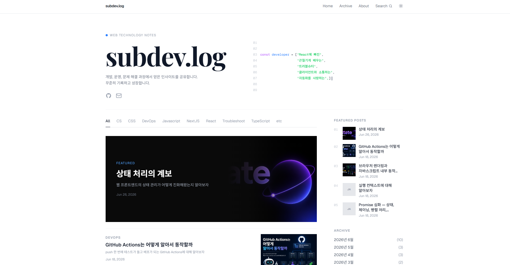
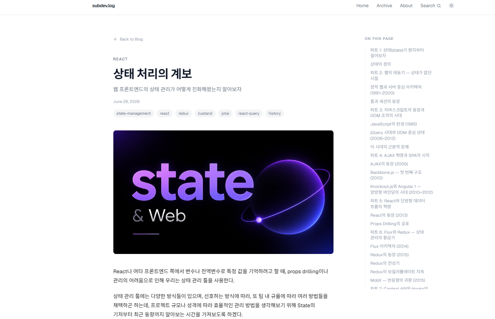
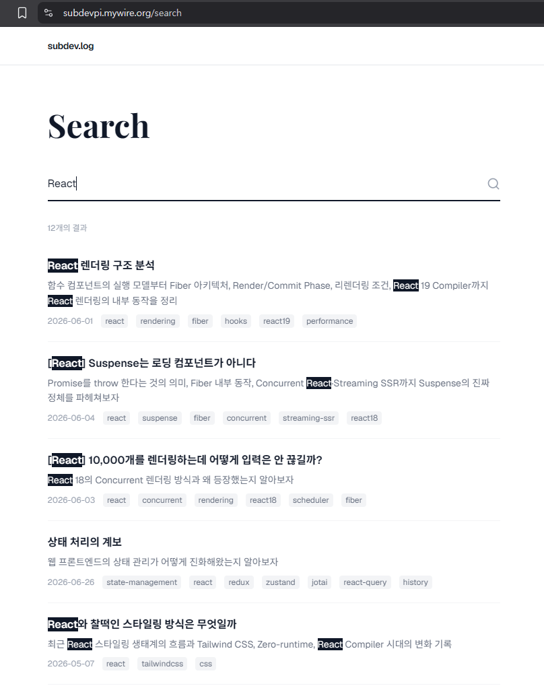
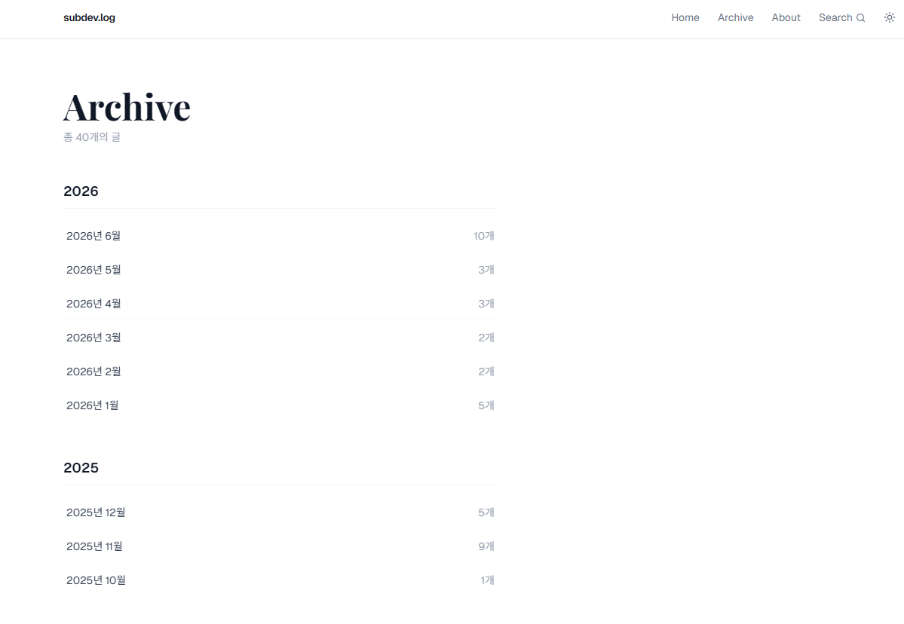
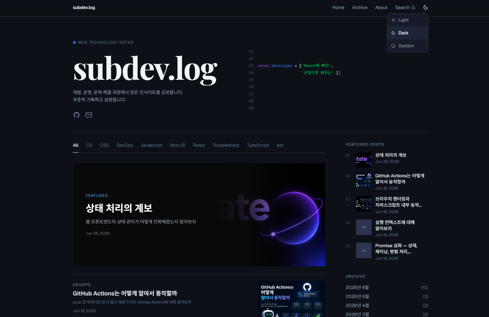

# subdev.log

개발하며 학습한 내용을 기록하는 개인 기술 블로그입니다.  
Next.js App Router 기반으로 정적 Markdown 파일을 콘텐츠 소스로 사용합니다.

<!-- screenshot: 메인 페이지 전체 (Hero + CategoryFilter + PostGrid + Sidebar) -->


---

> 정적 이미지(썸네일 등)는 추후 외부 이미지 저장소(S3, 홈랩 이미지 서버 등)로 이전 예정입니다.  
> 현재는 로컬로 서빙합니다.

> 또한 slack 훅을 활용한 실시간 모니터링 시스템도 구현 예정입니다.

> SEO는 이미지, 출처 표기 등의 사유로 현재 내부 문서 읽기 용도만을 위해 아직 기능 구현 전입니다.

---

## Features

- Markdown 기반 포스팅 (frontmatter로 메타데이터 관리)
- 카테고리 필터 (URL searchParams 기반, SEO 친화적)
- 전문 검색 (Fuse.js, 빌드 타임 인덱스 생성)
- 코드 하이라이팅 (Shiki / rehype-pretty-code)
- 아카이브 (연/월별 포스트 목록)
- 다크모드 지원
- 반응형 레이아웃
- Docker 컨테이너 배포 + Watchtower 자동 업데이트

---

## Pages

| 경로 | 설명 |
|---|---|
| `/` | 포스트 목록 (카테고리 필터, 사이드바) |
| `/posts/[category]/[slug]` | 포스트 상세 (ToC, 코드 하이라이팅) |
| `/search` | 전문 검색 |
| `/archive` | 연도별 아카이브 |
| `/archive/[year]` | 월별 아카이브 |
| `/about` | 블로그 소개 |

<!-- screenshot: 포스트 상세 페이지 (Table of Contents + 코드 블록 하이라이팅) -->

<!-- screenshot: 검색 페이지 (검색 입력 + 결과 목록) -->

<!-- screenshot: 아카이브 페이지 (연도/월별 목록) -->

<!-- screenshot: 다크모드 메인 페이지 -->


---

## Tech Stack

| 분류 | 사용 기술 |
|---|---|
| Framework | Next.js 16 (App Router) |
| Language | TypeScript |
| Styling | TailwindCSS v4 |
| Content | Markdown + gray-matter |
| MD Rendering | react-markdown, remark-gfm |
| Code Highlight | rehype-pretty-code (Shiki) |
| Search | Fuse.js |
| Date | date-fns |
| Animation | Lenis (smooth scroll) |
| 3D | Three.js |
| Deployment | Docker, Nginx, Watchtower |

---

## Project Structure

```
src/
├── app/                    # App Router 라우트
│   ├── page.tsx            # 메인 (포스트 목록)
│   ├── posts/[category]/[slug]/
│   ├── search/
│   ├── archive/
│   └── about/
│
├── components/
│   ├── ui/                 # 범용 UI 컴포넌트
│   ├── common/             # 공통 컴포넌트
│   ├── layout/             # 레이아웃 (Header, Sidebar, HeroSection 등)
│   └── post/               # 포스트 관련 컴포넌트
│
├── features/               # 기능별 모듈 (search 등)
├── hooks/                  # 커스텀 훅
├── lib/                    # 마크다운 처리 유틸
├── services/               # 데이터 패칭 함수 (getPosts, getCategories 등)
├── constants/              # 상수 (site 메타, 라우트 등)
├── types/                  # 공통 타입 정의
└── utils/                  # 유틸 함수

content/
└── posting/
    ├── React/
    ├── NextJS/
    ├── TypeScript/
    ├── Javascript/
    ├── DevOps/
    ├── CS/
    ├── CSS/
    ├── Troubleshoot/
    └── etc/

public/
└── assets/
    ├── readme/             # README 스크린샷
    └── thumbnails/         # 포스트 썸네일 이미지
```

---

## Content

### 포스트 추가

`content/posting/<카테고리>/` 폴더에 `.md` 파일을 생성합니다.

```md
---
title: "포스트 제목"
date: "2025-01-01"
description: "포스트 요약"
tags: ["React", "Hook"]
thumbnail: "/assets/thumbnails/example.jpg"
---

본문 내용...
```

`category`는 폴더명에서 자동으로 결정됩니다.

### PostMeta 타입

```ts
interface PostMeta {
  slug: string;         // 파일명 (확장자 제외)
  category: string;     // 폴더명
  title: string;
  date: string;         // ISO 형식
  description: string;
  thumbnail?: string;
  tags: string[];
  readTime: number;     // 분 단위
}
```

---

## Getting Started

```bash
npm install
npm run dev
```

빌드 타임에 검색 인덱스(`public/search-index.json`)를 자동 생성합니다.  
`dev` 명령은 Next.js 개발 서버와 인덱스 watch 빌드를 동시에 실행합니다.

```bash
npm run build   # 프로덕션 빌드 (prebuild로 인덱스 먼저 생성)
npm start       # 프로덕션 서버 실행
```

---

## Deployment

Docker + Nginx + Watchtower 조합으로 홈서버에 배포합니다.  
GitHub Actions → ghcr.io 이미지 푸시 → Watchtower 자동 풀 & 재배포 흐름입니다.

```bash
docker compose up -d
```

```
┌─────────────┐     ┌──────────────┐     ┌──────────────┐
│   GitHub    │────▶│   ghcr.io    │────▶│  Watchtower  │
│  (Actions)  │     │  (Registry)  │     │ (자동 업데이트) │
└─────────────┘     └──────────────┘     └──────────────┘
                                                │
                                         ┌──────▼──────┐
                                         │   blog:3000  │
                                         └──────────────┘
                                                │
                                         ┌──────▼──────┐
                                         │    Nginx     │
                                         │  (80 / 443)  │
                                         └──────────────┘
```

배포 상세는 [라즈베리파이 홈서버 Next.js 블로그 배포 포스팅](https://subdevpi.mywire.org/posts/DevOps/%EB%9D%BC%EC%A6%88%EB%B2%A0%EB%A6%AC%ED%8C%8C%EC%9D%B4-%ED%99%88%EC%84%9C%EB%B2%84%EC%97%90-Next.js-%EB%B8%94%EB%A1%9C%EA%B7%B8-%EB%B0%B0%ED%8F%AC%ED%95%98%EA%B8%B0)에 상세 기재됨

---

Built with Next.js · TypeScript · TailwindCSS · Claude Code